```markdown
🍔 Food Delivery App (React Native + Node.js)

A full-stack food delivery application built using **React Native (Expo)** for the frontend and **Node.js + MongoDB** for the backend. This app allows users to browse restaurants, place orders, track deliveries, and restaurant owners to manage their listings.


---

## 🚀 Features

### 🧑‍🍳 User Side
- Login/SignUp
- Browse Restaurants by Category
- View Dishes in Restaurants
- Add to Cart & Place Orders
- Track Orders (Preparing / Delivering)

### 🏢 Restaurant Owner Side
- Login as Owner
- Add/Manage Restaurants & Dishes
- View Incoming Orders

---

## 🛠️ Tech Stack

### 📱 Frontend (Expo React Native)
- React Native
- Expo CLI
- Redux Toolkit
- AsyncStorage
- Tailwind CSS (via NativeWind)
- Axios
- React Navigation

### 🌐 Backend (Node.js)
- Node.js + Express
- MongoDB + Mongoose
- JWT Authentication
- Multer (Image Uploads)
- dotenv

---

## 🔧 Setup Instructions

### 1. Clone the repository

```bash
git clone https://github.com/your-username/food-delivery.git
cd food-delivery
````

---

### 2. Setup Backend

```bash
cd backend
npm install
```

* Create a `.env` file:

```env
PORT=3000
MONGO_URI=mongodb://localhost:27017/fooddelivery
ACCESS_TOKEN_SECRET=your_access_token_secret_here
REFRESH_TOKEN_SECRET=your_refresh_token_secret_here
PUBLIC_KEY=your_public_key_here
```

* Start the server:

```bash
npm run dev
```

---

### 3. Setup React Native App

```bash
cd ../my-expo-app
npm install
```

* Create a `.env` file:

```env
API_URL=http://localhost:5000
```

> Note: Use your LAN IP (e.g. `http://192.168.1.x:5000`) if running on physical mobile device.

* Start the app:

```bash
npx expo start
```


## 🚀 Features

- 🏠 Home screen with featured restaurants
- 📂 Category & Dish listing
- 🍽️ Restaurant detail page
- 🛒 Add to cart functionality
- 📦 Order tracking interface
- ⚡ Optimized UI with Tailwind CSS

---

## 📸 Screenshots

<div align="center">

### 🔐 Authentication

| Login Screen | SignUp Screen | Login Successful |
|--------------|---------------|------------------|
| 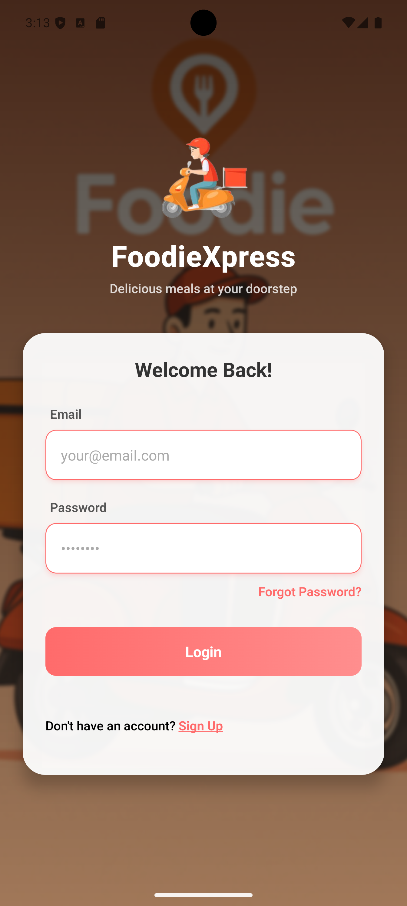 | 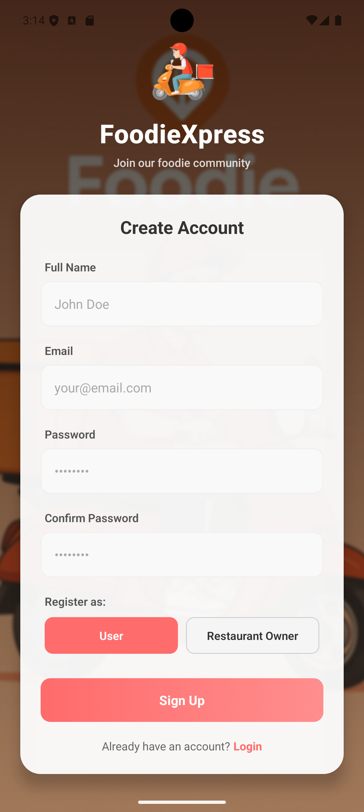 | 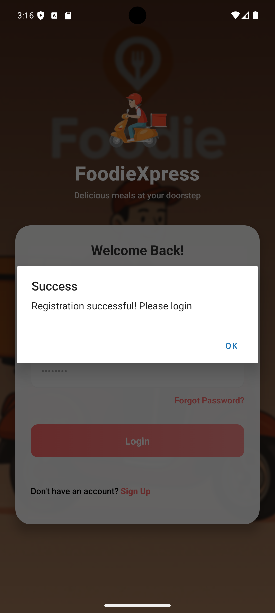 |

---

### 🧾 Restaurant Owner Flow

| Restaurant Owner Form | Restaurant Home Screen 1 | Restaurant Home Screen 2 | Restaurant Home Screen 3 |
|------------------------|--------------------------|--------------------------|--------------------------|
| 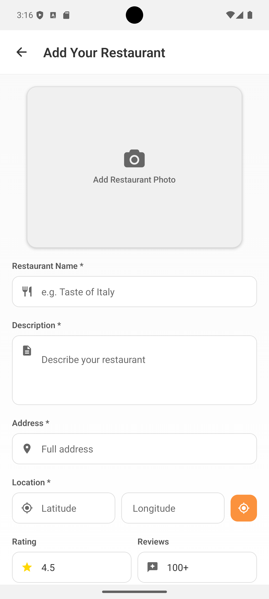 | 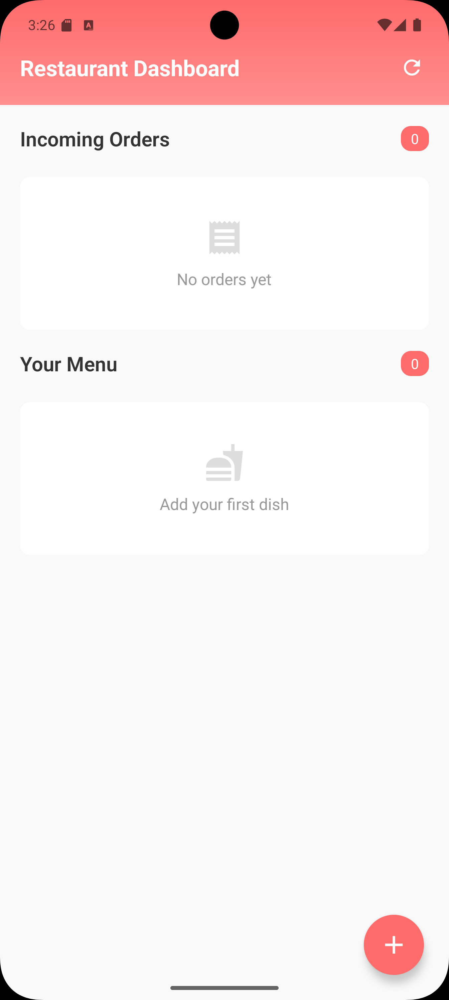 | 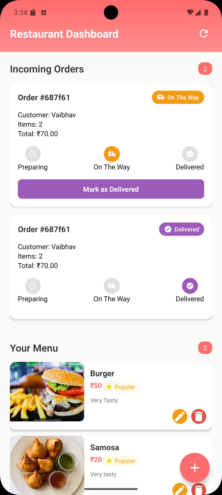 | 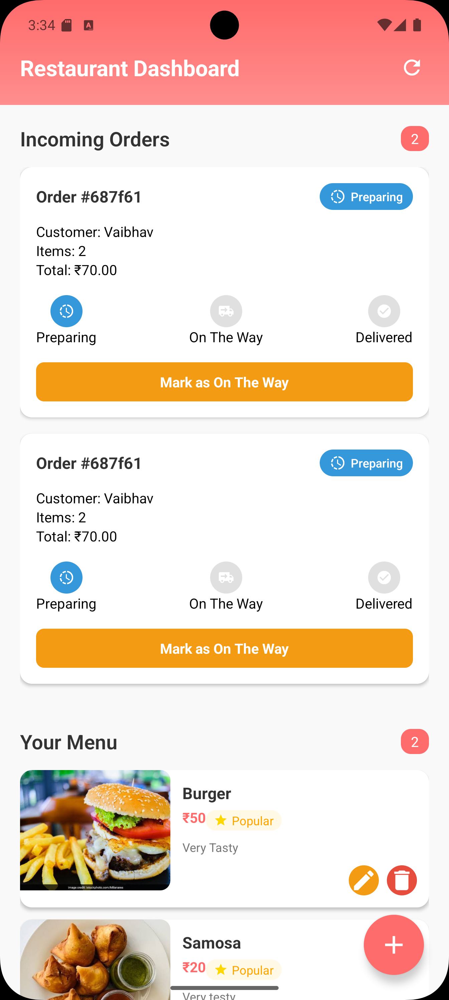 |

---

### 🍽️ User Flow

| User Home Screen | Select Restaurant | Cart Screen |
|------------------|-------------------|-------------|
| 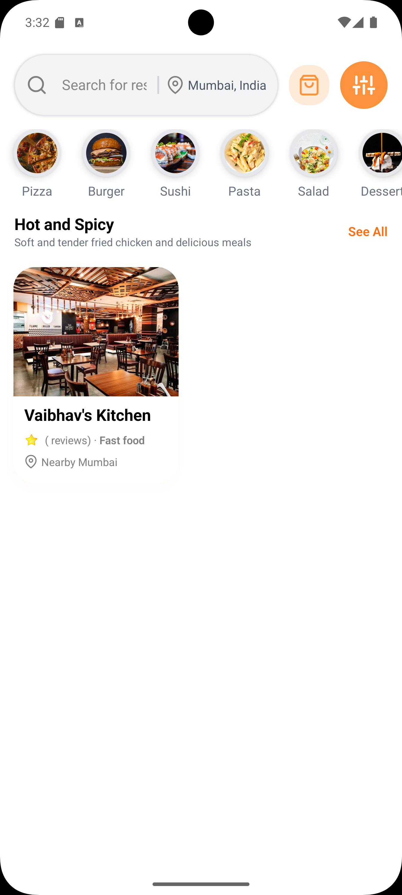 | 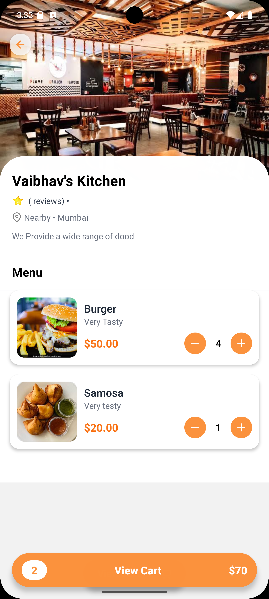 | 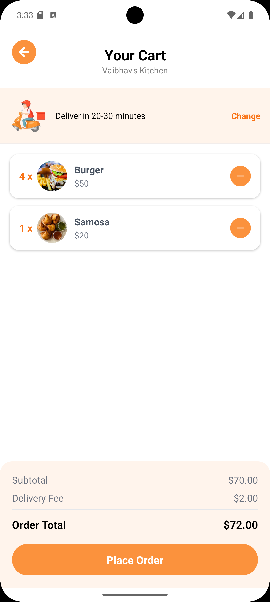 |

---

### 🚚 Delivery & Orders

| Delivery Screen | My Orders Screen | Order Details Screen | Final Status Screen |
|-----------------|------------------|-----------------------|---------------------|
| 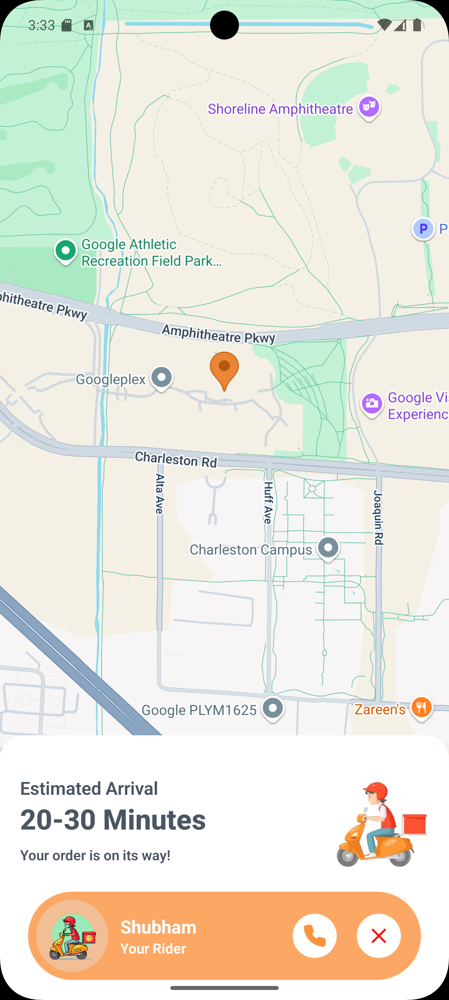 | 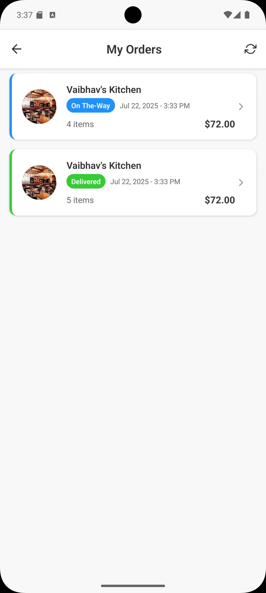 | 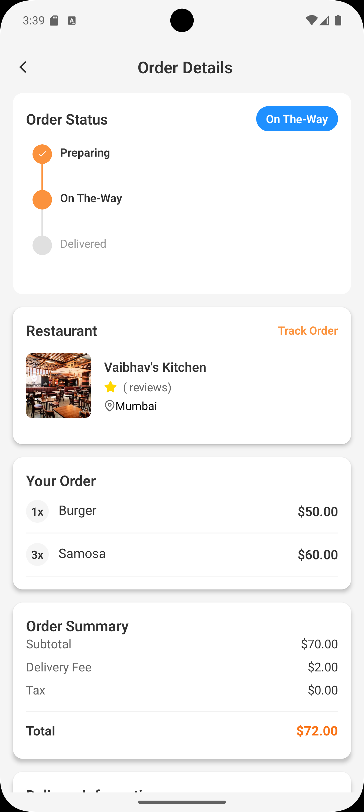 | 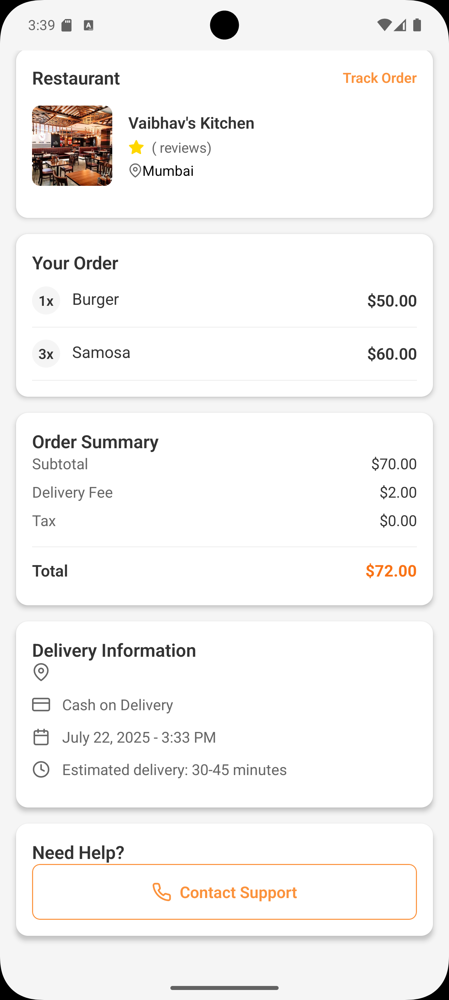 |

| Extra Delivery Screen |
|-----------------------|
| 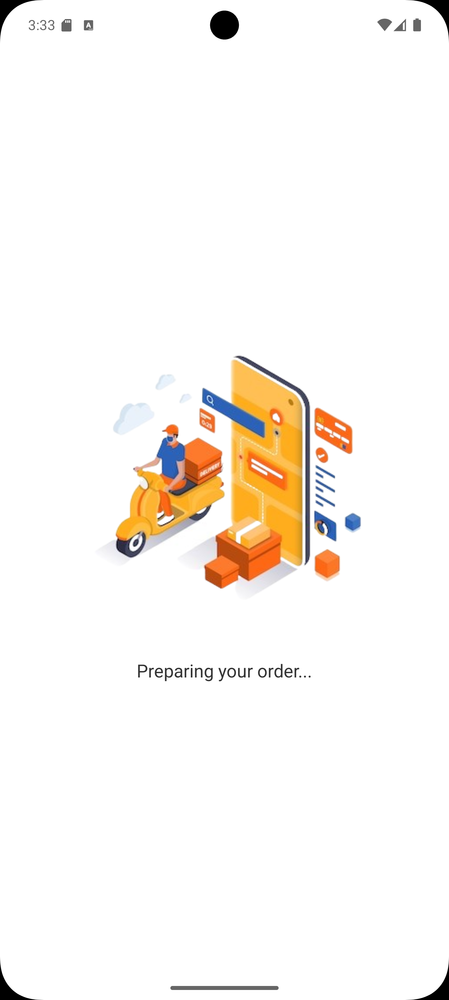 |

</div>

---

## 📦 API Endpoints Overview

* `/api/category` – Get Categories
* `/api/featured` – Get Featured Restaurants
* `/api/user` – Auth (Signup/Login)
* `/api/order` – Place/Fetch Orders

---

## 📚 Environment Variable Setup

### Backend `.env`

```env
PORT=3000
MONGO_URI=mongodb://localhost:27017/fooddelivery
ACCESS_TOKEN_SECRET=your_access_token_secret_here
REFRESH_TOKEN_SECRET=your_refresh_token_secret_here
PUBLIC_KEY=your_public_key_here
```

### Frontend `.env`

```env
API_URL=http://192.168.1.xx:5000
```

Use Expo's `expo-env` or `babel-plugin-dotenv` to access these in code:

```ts
import { API_URL } from "@env";
```

---

## 🤝 Contributing

Pull requests are welcome. For major changes, please open an issue first to discuss what you would like to change.

---

---

## 🙌 Author

Made with ❤️ by Vaibhav Patil

```

